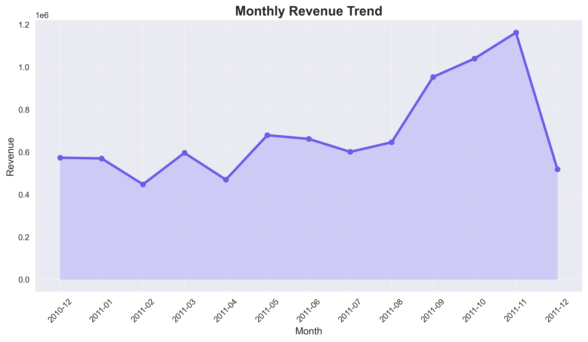
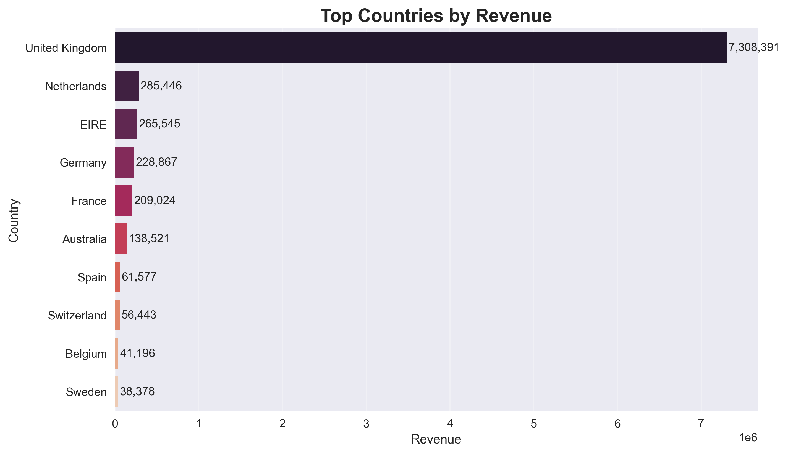
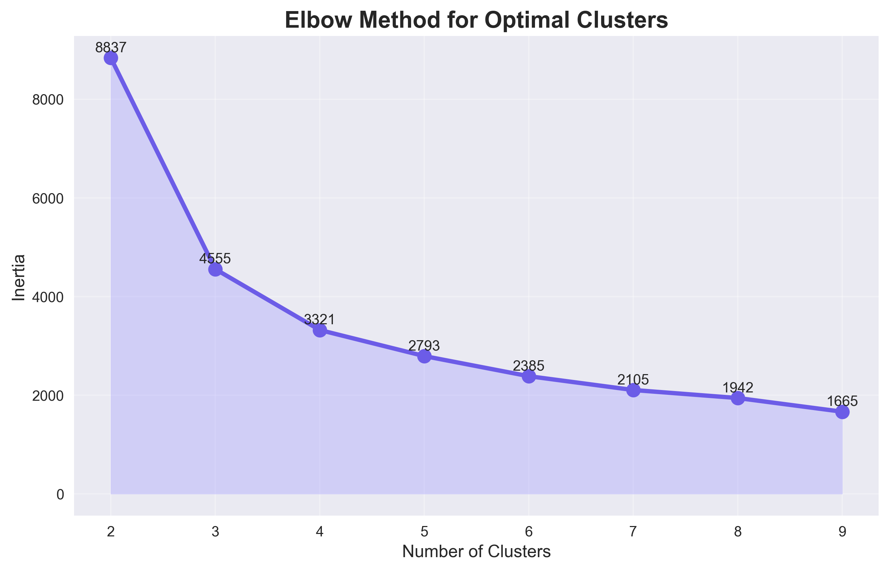
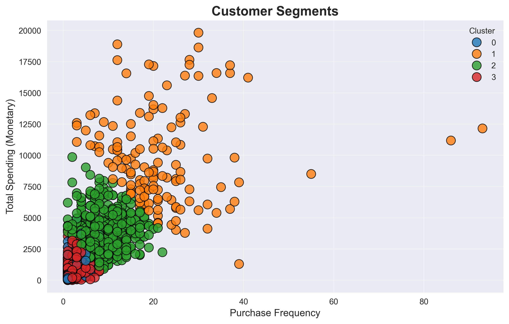
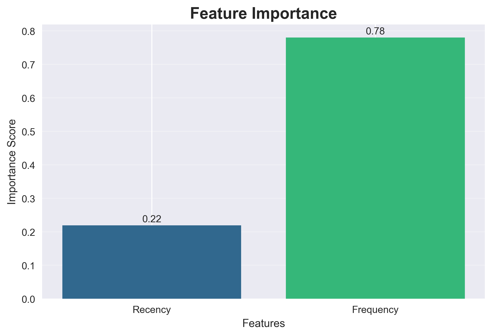

# Customer Segmentation & Spend Analysis

## Project Overview

This project performs customer segmentation on an e-commerce transaction dataset using RFM (Recency, Frequency, Monetary) analysis and K-Means clustering. The goal is to identify distinct groups of customers based on purchasing behavior and explore patterns in customer spending.

A machine learning model is also trained to estimate customer spending behavior using Recency and Frequency features.

---

## Dataset

**Online Retail Dataset (UCI Machine Learning Repository)**
The dataset contains transactions from a UK-based online retail store between 2010 and 2011.

Key columns include:

* `InvoiceNo` – Transaction ID
* `StockCode` – Product code
* `Description` – Product description
* `Quantity` – Number of items purchased
* `InvoiceDate` – Transaction date
* `UnitPrice` – Price per unit
* `CustomerID` – Unique customer identifier
* `Country` – Customer location

---

## Project Workflow

1. **Data Cleaning**

   * Removed missing `CustomerID`
   * Removed cancelled orders
   * Removed negative quantities and prices

2. **Feature Engineering**

   * Created `TotalPrice`
   * Generated RFM metrics (Recency, Frequency, Monetary)

3. **Outlier Handling**

   * Removed extreme monetary outliers (top 1%)

4. **Customer Segmentation**

   * Applied K-Means clustering
   * Used Elbow Method to guide cluster selection

5. **Customer Spend Modeling**

   * Random Forest model to estimate customer spending behavior

---

## Visualizations

The project generates several visualizations saved in the `visuals/` folder.

### Monthly Revenue Trend


### Top Countries by Revenue


### Elbow Method for Clustering


### Customer Segments Scatter Plot


### Feature Importance Chart

---

## Key Insights

* A small group of customers contributes a large share of revenue.
* Customer segments differ significantly in purchase frequency and total spend.
* Frequency is the strongest predictor of customer spending behavior.

---

## Project Structure

```
Customer-Segmentation-CLV
│
├── data
│   └── Online Retail.xlsx
│
├── notebooks
│   └── customer_segmentation.ipynb
│
├── visuals
│   ├── monthly_revenue.png
│   ├── top_countries.png
│   ├── elbow_method.png
│   ├── customer_segments.png
│   └── feature_importance.png
│
├── requirements.txt
└── README.md
```

---

## How to Run

1. Clone the repository
2. Install dependencies

```
pip install -r requirements.txt
```

3. Open the notebook

```
jupyter notebook notebooks/customer_segmentation.ipynb
```

---

## GitHub Pages Portfolio

This repository includes a static portfolio page for GitHub Pages:

```
index.html
styles.css
```

To publish it, go to the repository settings on GitHub, open **Pages**, and set the source to the `main` branch with the root folder.

---

## Tools Used

* Python
* Pandas
* NumPy
* Matplotlib
* Seaborn
* Scikit-learn
* Jupyter Notebook

---

## Notes

This project estimates **current customer spending behavior** rather than predicting full customer lifetime value (CLV). The analysis is exploratory and focuses on segmentation and spend patterns rather than long-term forecasting.
